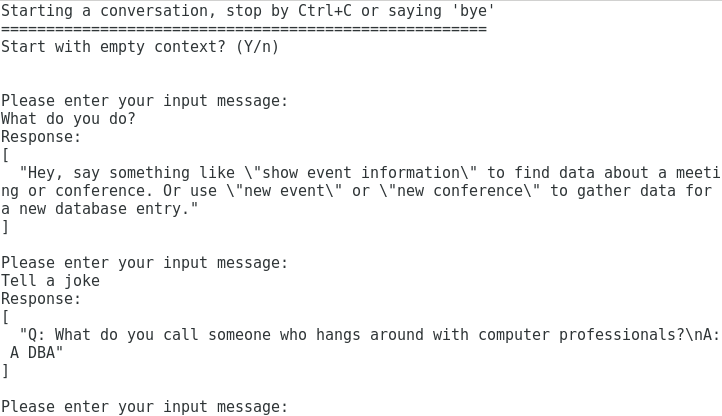

# Watson Conversation Tool
The Watson Conversation Tool (wctool) is a Python-based command line tool to manage workspaces of the [IBM Watson Assistant (formerly Conversation)](https://www.ibm.com/watson/developercloud/doc/conversation/index.html) service on IBM Cloud. It was written to explore the API to manage workspaces.   
Note that to manage workspaces from the command line this tool is not a requirement. The [API provides REST functions](https://www.ibm.com/watson/developercloud/conversation/api/v1/?curl#workspaces) that can be invoked from tools like `curl`.

(Update on 2018-11-22) The service Watson Assistant evolved over time. It has introduced the concepts of **skill** and **assistant** instead of **workspace**. It also added an API Version 2. That API interacts with an assistant, requires to open and close a session which manages the context on the server, and only focuses on the conversation. To cater to the API V2, I introduced a second script **watoolV2**. Documentation is following...


This project is described in the following blog posts:
* [Manage Your Watson Conversations from the Command Line or App](https://blog.4loeser.net/2017/03/manage-your-watson-conversations-from.html)
* [Watson Conversation: How to Manage Workspaces](https://www.ibm.com/blogs/bluemix/2017/04/watson-conversation-manage-workspaces/)
* [Updates to Chatbot API and Tooling](https://blog.4loeser.net/2017/05/updates-to-chatbot-api-and-tooling.html)
* [Chatbots: Testing Contexts](https://blog.4loeser.net/2017/07/chatbots-testing-contexts.html)
* [Extended: Manage and interact with Watson Assistant from the command line](https://blog.4loeser.net/2018/07/extended-manage-and-interact-with.html)
* [IBM Watson Assistant: Chatbot tool now supports testing client actions](https://blog.4loeser.net/2018/10/ibm-watson-assistant-chatbot-tool-now.html)

# Overview
The repository holds two tools, both Python scripts. In order to use them, you need Python and the SDK for the Watson services installed. The tools are:
* [`wctool.py`](wctool.py): The original Watson Conversation Tool which is based on [API version V1](https://console.bluemix.net/apidocs/assistant?language=python). It allows to manage (list, import, export, ...) workspaces, obtain logs and via its dialog option to converse with the chat service.
* [`watoolV2.py`](watoolV2.py): The newer script to have a dialog with the Watson Assistant service, based on [API version V2](https://console.bluemix.net/apidocs/assistant-v2?language=python#introduction).

If you have been working with the Watson service and Python before, you probably already have everything installed. If not, you need to install Python and then head over to the [Watson Developer Tools](https://www.ibm.com/watson/developercloud/developer-tools.html) and follow the link to the [Python SDK](https://github.com/watson-developer-cloud/python-sdk). Install the SDK, too. Now download a copy of this repository or clone it.   

## wctool.py
To use the tool, copy `config.sample.json` or `config.ICFsample.json` to `config.json` and insert your service credentials. Note that the service URL depends on the IBM Cloud region. It is shown as part of the credentials. Either username / password or the API key are needed. If you have multiple environments then you can specify the configuration file using the `-config myconfig.json` option.    

Some commands and parameters:
```
LIST all workspaces:
-l  [-config config-file]

GET (full) information about a workspace and print or save it
-g -id workspaceID -full  [-config config-file]      
-g -id workspaceID -o outfile  [-config config-file]

UPDATE an existing workspace (with optionally intents, entities, etc. read from existing workspace file), replace by default or optionally append:
-u -id workspaceID [-name newName] [-lang newLanguage] [-desc newDescription]
  [-intents] [-entities] [-dialog_nodes] [-counterexamples] [-metadata]  [-append]
  [-i input-workspace] [-config config-file]

DELETE an existing workspace:
-delete -id workspaceID  [-config config-file]

CREATE a new workspace (with intents, entities etc. read from existing workspace file):
-c -name workspace-name -desc workspace-description -lang workspace-language  
   -i input-workspace [-config config-file]

List LOGS for a specific workspace with an optional filter string
-logs -id workspaceID -filter filter-string  [-config config-file]

Have DIALOG using a specific workspace
-dialog -id workspaceID [-outputonly] -[-actionmodule file] [-config config-file]
```

See the included Jupyter Notebook [SampleSession.ipynb](SampleSession.ipynb) for details on how to invoke the commands. Note that in the current state the tool prints out the values for all possible options for debugging purposes. This could be simply disabled in the code. The [filter expressions](https://www.ibm.com/watson/developercloud/doc/conversation/filter-reference.html) are documented as part of the Watson Conversation service.

## watoolV2.py
To use the tool, copy `config.sample.json` or `config.ICFsample.json` to `config.json` and insert your service credentials. Note that the service URL depends on the IBM Cloud region. It is shown as part of the credentials. Note that to use both tools with the same config file the API version for this **watoolV2** needs to be assigned to the key **versionV2**.  If you have multiple environments then you can specify the configuration file using the `-config myconfig.json` option.  

Some commands and parameters:
```
Have DIALOG using a specific workspace
-dialog -id assistantID [-outputonly] -[-actionmodule file] [-config config-file]
```

## Dialog option and contexts
When using the dialog option, the current session context is stored (persisted) in `session_context.json` or `session_contextV2.json`. It allows to continue a session later on. The file is closed after writing out the current context. After the new message input is obtained from the user, the file `session_context.json` / `session_contextV2.json` is opened again and its content retrieved. This allows to modify the context object between dialog turns. Context variables can be set, modified or deleted. This includes system variables. Use with caution... :)   
The stored session context can even be used to switch to different workspaces or even instances with every dialog turn. It helps command line testing of duplicated / replicated chatbots for highly available apps.

The optional parameter `-outputonly` lets the tool only dump the returned text output, not the entire response object. This is useful when testing the output or showcasing a dialog from the command line.

The tool supports server actions in Watson Assistant. If present in the config file, the tool will pass in the IBM Cloud Functions credentials. As a starter, use `config.ICFsample.json`. The option was introduced to work on this [tutorial for a database-backed Slackbot which makes use of IBM Cloud Functions](https://console.bluemix.net/docs/tutorials/slack-chatbot-database-watson.html).

The tool also supports client actions. You can pass in the file to handle client actions using `-actionmodule filename`. A sample module is shown in file [`handleClientAction.sample.py`](handleClientAction.sample.py) and [`handleClientActionV2.sample.py`](handleClientActionV2.sample.py). It could be dynamically loaded using, e.g., `-actionmodule handleClientAction.sample`. Note that the file extension `.py` is not passed in.



# Documentation and Resources
Here are some useful links to documentation and other resources:
* Watson Assistant service: https://console.bluemix.net/docs/services/conversation/index.html#about
* API for Watson Conversation service: https://www.ibm.com/watson/developercloud/conversation/api/v1/#introduction
* Python SDK, Watson Developer Cloud: https://github.com/watson-developer-cloud/python-sdk
* Conversation API file in Python SDK: https://github.com/watson-developer-cloud/python-sdk/blob/master/watson_developer_cloud/conversation_v1.py
* The `argparse` module used for this tool: https://docs.python.org/2/library/argparse.html

# License
See [LICENSE](LICENSE) for license information.

The tool is provided on a "as-is" basis and is un-supported. Use with care...

# Contribute / Contact Information
If you have found errors or some instructions are not working anymore, then please open an GitHub issue or, better, create a pull request with your desired changes.

You can find more tutorials and sample code at:
https://ibm-cloud.github.io/ and https://console.bluemix.net/docs/tutorials/index.html#tutorials
